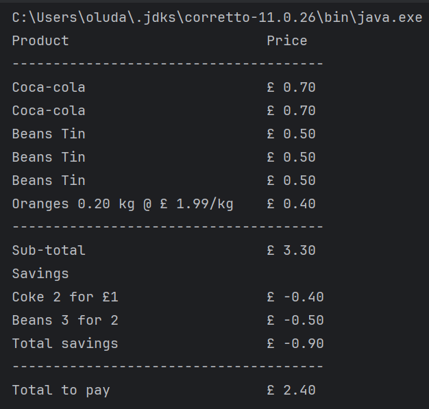

# Supermarket Pricing Calculator

## Overview
This project implements a **Basket Price Calculator** that computes the total price for a shopping basket based on different pricing structures (including discounts). 
It supports both **individual product pricing** and **category-wide pricing**, ensuring flexibility and extensibility.

## Features
- **Bulk Discounts:**
    - Three tins of beans for the price of two
    - Two cans of Coca-Cola for £1
    - Any three ales for £6
- **Weight-Based Pricing:**
    - Onions priced at 29p/kg
- **Flexible Pricing Structure:**
    - Supports product-specific and category-wide pricing rules

## Technologies Used
- **Java 11+**
- **JUnit 5** for unit testing
- **Maven** for dependency management

## Setup and Installation
NB: Ensure you have Java (JDK 11+) and Maven installed.

1. Clone the repository:
   ```sh
   git clone https://github.com/damzxyno/supermarket-pricing.git
   ```
2. Navigate to the project directory:
   ```sh
   cd supermarket-pricing
   ```
3. Build the project:
   ```sh
   mvn clean install
   ```
4. Run tests:
   ```sh
   mvn test
   ```

## Usage
To use the pricing calculator:
1. Create a basket and add products.
2. Use `BasketCalculatorImpl` to calculate the total price.
3. Optionally, print the receipt using `BasketPrinterImpl`.

Example:
```java
Basket basket = new Basket();
basket.put(beans, 6);
basket.put(cocacola, 2);
basket.put(oranges, 0.2);
        
BasketCalculator pc = new BasketCalculatorImpl(
        uniProductPricing,
        productCategoryPricing,
        productCategoryProductSet);
    
BasketPrinter bp = new BasketPrinterImpl();
ReceiptResponse receiptResponse = pc.calculateBasketPrice(basket);
bp.printPriceCalculationBreakDown(receiptResponse);
```

Sample Console Display:



## Key Components

### 1. **Entities**
- `Product`: Represents a single product.
- `ProductCategory`: Enum categorises products.
- `PricingStructure`: Defines special pricing rules.
- `Basket`: Holds products and their quantities.

### 2. **Services**
- `BasketCalculatorImpl`: Handles pricing calculations.
- `BasketPrinterImpl`: Prints the receipt.

### 3. **Interfaces**
- `BasketCalculator`: Abstracts the pricing logic.
- `BasketPrinter`: Abstracts the printing logic.


## Design Decisions
### **1. SOLID Principles**
- **Single Responsibility Principle (SRP):** Each class is responsible for a specific task, such as calculating basket prices, formatting receipts, or handling product details.
- **Open/Closed Principle (OCP):** The design allows new pricing rules to be added without modifying existing code.
- **Liskov Substitution Principle (LSP):** Interfaces and abstract classes ensure that derived classes can replace base classes without altering behaviour.
- **Interface Segregation Principle (ISP):** Small, focused interfaces (e.g., `BasketCalculator`, `BasketPrinter`) ensure that classes only implement what they need.
- **Dependency Inversion Principle (DIP):** High-level modules depend on abstractions (`BasketCalculator` interface), not concrete implementations.

### **2. Use of Interfaces**
Interfaces such as `BasketCalculator` and `BasketPrinter` allow flexibility and easier testing by decoupling the implementation from the core logic. This promotes extensibility and makes it easier to introduce new pricing strategies or output formats.

### **3. Builder Pattern**
The **Builder Pattern** (a prominent GOF Design pattern) is employed in classes like`Product`, `Pricing Structure`, `Basket`, `ReceiptPriceSavingtItem`, `ReceiptProductItem` and `ReceiptResponse`. It simplifies complex object creation with optional parameters while improving readability.

### **4. Strategy Pattern**
The pricing strategy implementation separates different pricing mechanisms, allowing for easy extensions (e.g., buy-one-get-one-free, category-based discounts). This ensures flexibility when adding new pricing rules without modifying the core logic.

### **5. Dependency Injection**
Constructor-based dependency injection provides flexibility and testability. The `BasketCalculatorImpl` class receives pricing data structures via its constructor, making it easy to substitute or mock dependencies during testing.

### **6. Encapsulation using Custom Wrapper**
Instead of using a raw `HashMap<ProductCategory, List<ProductGroupCacheItems>>`, the design introduces a dedicated `ProductGroupCache` class. This approach provides:
- **Encapsulation & Readability:** It clearly expresses the intent of managing product groups.
- **Extensibility:** Allows adding validation, logging, or custom retrieval logic in one place.
- **Maintainability:** Keeps related logic centralized, reducing duplication.
- **Type Safety & Abstraction:** Prevents misuse by exposing only necessary operations.

### **7. Data Structures Used (HashMap/ Dictionary, ArrayList, LinkedList, Set, PriorityQueue)**
This project uses various data structures to ensure efficient handling of pricing rules, products, data transfer and basket calculations.
These data structures were selected to optimise performance, readability, and extensibility, while maintaining flexibility for adding new features such as additional discount strategies or future product enhancements.

1.  **Map (HashMap)**
    - **Purpose:** Used to store key-value pairs for efficient lookups.
    - **Usage in Project:**
        - `Map<Long, List<PricingStructure>> uniProductPricing`: Maps product IDs to their associated pricing structures, allowing fast lookup of pricing rules for individual products.
        - `Map<ProductCategory, PricingStructure> productCategoryPricing`: Maps product categories to specific pricing structures. This is used to manage category-based discounts or special pricing for sets of products.
        - `Map<ProductCategory, Set<Long>> productCategoryProductSet`: Maps product categories to sets of product IDs, ensuring quick validation and lookups for products in specific categories.

2. **List (ArrayList and LinkedList)**
    - **Purpose:** Used to store ordered collections of items, with fast access and iteration.
    - **Usage in Project:**
        - `List<ReceiptProductItem>` and `List<ReceiptPriceSavingItem>`: These lists hold the product and savings details for the receipt. The flexibility of a `List` ensures items can be added or iterated over easily in the calculation and printing processes.
        - `LinkedList<PricingStructure>`: The `LinkedList` is used specifically for storing pricing structures related to products. This is beneficial when the list may change or grow, offering efficient insertions and deletions.

3. **Set (HashSet)**
    - **Purpose:** Used to store unique items without duplicates, offering fast membership tests.
    - **Usage in Project:**
        - `Set<Long>` in `Map<ProductCategory, Set<Long>>`: This set holds the unique product IDs for each product category, allowing the system to quickly determine if a product belongs to a specific category when calculating its price.

4. **PriorityQueue**
    - **Purpose:** Used to store a collection of items in a sorted order, typically for efficient access to the smallest or largest item.
    - **Usage in Project:**
        - `PriorityQueue<Product>`: This is used for sorting products within a specific category by price. It allows for efficient processing of product bundles based on the lowest price, which is important for calculating the total cost of category-based discounts.

## ⚠️ Trade-offs & Limitations
- **Limited UI/UX**: Only prints to console, but can be adapted for a UI.
- **Assumes all pricing rules are predefined**: Dynamic rule updates at runtime are not yet supported.
- **No Database Integration**: Uses in-memory data structures, making it unsuitable for production-scale deployments.

## Future Improvements
- **REST API** for integrating with other applications.
- Support for **custom discount rules** via configuration.
- **Database integration** for storing product and pricing information.


